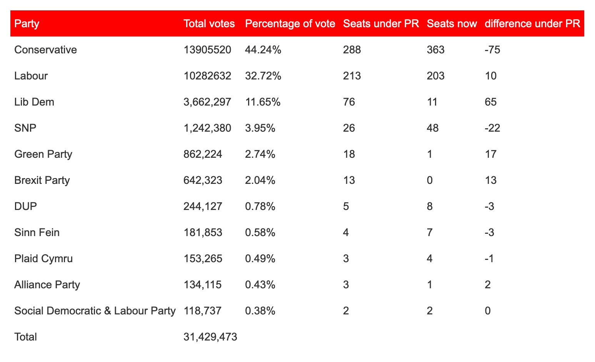

# Constituency

## Proportional representation of UK constituencies

The idea behind this project is to see how a proportional representation (PR) system would have altered results in the last UK general election. The plan is to merge neighbouring constituencies in the UK into 'super' constituencies with 2 / 3 / 4 / etc of them merged together into a larger one and use the [D'Hondt](https://en.wikipedia.org/wiki/D%27Hondt_method) method to allocate seats in this 'super' constituency.

### Motivation
After the 2019 UK general election an article appeared in [Wales online](https://www.walesonline.co.uk/news/politics/proportional-representation-general-election-votes-17414366?_ga=2.214928336.650232768.1586343291-62203819.1586343291) suggesting that if the UK adopted a PR system the seat allocation of parliament would look as follows:

The seat numbers under PR were calculated by multiplying the percentage of votes of votes obtained by each politcal party by the total number of seats in the UK parliament, which is 650 (note that the percentages used in these calculations have since been revised 
[see here](https://en.wikipedia.org/wiki/2019_United_Kingdom_general_election)). These figures are based on a very simple nationwide PR system but there are certain caveats, most notably it has not included a  a minimum threshold, below which any party cannot be allocated a seat. This can vary but if it were set at 5% nationwide then that would remove 74 seats from the above analysis (including all SNP seats). There could be some 'regional' allowance for the SNP, Plaid Cymru and the parties in Northern Ireland to be allocated seats, however it would still likely mean that there would be no MPs from the Green party.

In addition the UK has the tradition of a link between constituents and their constituency MP rather than being allocated by a party list, so a nationwide PR system would not be considered. Of course there are other PR system that do have a link between a constituency and its MP, e.g. [Mixed member proportionality](https://en.wikipedia.org/wiki/Electoral_system_of_New_Zealand#MMP_in_New_Zealand) in New Zealand, or the [German](https://en.wikipedia.org/wiki/Electoral_system_of_Germany) voting system. However we cannot apply the the results from the UK general election to these systems as they require a second vote, which is not available as each member of the UK electorate gets a single vote in their elections.

During elections for the European Parliament there was a PR system used whch only allowed one vote, the [D'Hondt](https://en.wikipedia.org/wiki/D%27Hondt_method) method, whereby large regions of the UK had multiple MEPs and they were allocated to parties over several rounds by dividing the votes a party received by the number of MEPs already allocated (see the [wikipedia](https://en.wikipedia.org/wiki/D%27Hondt_method) page for more details and examples).

An initial thought was to apply the D'Hondt method to the results of the UK general election, aggregating the results from the constituencies by their [statistical regions](https://en.wikipedia.org/wiki/NUTS_statistical_regions_of_the_United_Kingdom), however this was not considered further for two reasons:
1. we would still have a large region (e.g. London has 73 MPs) so it would be difficult to 'know' your local MP.
1. it would also be too easy to calculate and we were looking for a more meatier project!!

Another method that could have been considered is if each constituency had 2 / 3 / 4 / etc MPs that could be allocated then what would the make-up of parliament have been if we applied the D'Hondt method to each constituency. This was not considered since it would have required doubling / tripling / etc the number of MPs.

The method that is going to be used is as follows:
1. rather than applying the D'Hondt method to an entire statistical region of the UK we will form sub-regions, neighbouring constituencies will be 'merged' from 2 / 3 / 4 / etc constituencies in the same statistical region.
1. the results from these merged constituencies will be aggregated and the D'Hondt method will be applied to these merged constituencies.
1. as the merging process will be a random process we will run the above steps repeatedly.

Whilst multiple MPs for a constituency might seem controversial it has a long history in the UK parliament with multi-member constituencies only being abolished in [1948](https://en.wikipedia.org/wiki/Multi-member_constituencies_in_the_Parliament_of_the_United_Kingdom). For example, at the 1945 general election 39 MPs (out of 640) represented multi-member constituencies [source](https://en.wikipedia.org/wiki/List_of_MPs_elected_in_the_1945_United_Kingdom_general_election) and for much of the 18th and 19th Century the City of London constituency returned 4 MPs [source](https://en.wikipedia.org/wiki/City_of_London_(UK_Parliament_constituency)).

To form the merged constituencies we will use the [Exact Cover](https://en.wikipedia.org/wiki/Exact_cover) problem and [Knuth's Algorithm X](https://en.wikipedia.org/wiki/Knuth%27s_Algorithm_X) to solve it.

Resources used in this project:
1. The shapefiles were obtained from [data.gov.uk](https://data.gov.uk/dataset/09762279-a9cf-49ce-b035-809c91ba4214/westminster-parliamentary-constituencies-december-2017-uk-bfc).
1. Election results were taken from the R package [`parlitools`](https://github.com/evanodell/parlitools).
1. David Goodger [code](http://puzzler.sourceforge.net/puzzler/exact_cover_dlx.py) and Bjarki Ágúst Guðmundsson [code](https://github.com/SuprDewd/algorithm_x_python) to implement Knuth's Algorithm X.